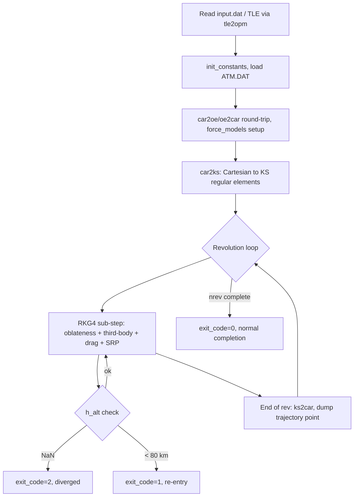

# ALGORITHM.md — KSROP

## 1. Overview
KSROP (KS Regular Orbit Propagator) is a Fortran numerical integrator for
Earth-satellite trajectories, using Kustaanheimo-Stiefel (KS) regularized
elements instead of raw Cartesian state, integrated with a 4th-order
Runge-Kutta-Gill (RKG4) scheme. It is the foundational propagator this
project's other repos build on: `OREM` embeds KSROP's own source files
(`Subrouts.F`, `TLEread.F`, `Legendre.F`, `propagate_ks.F`, which does not
exist as a standalone file in KSROP itself — it was refactored out of
`driver_KS.F` specifically for `OREM`'s callable-subroutine use — see §10)
directly under `OREM\ksrop\`, and `KSRENT-PY` is an independent Python port
of overlapping functionality. KSROP itself is a standalone driver
(`driver_KS.F`) plus a TLE-to-OPM conversion tool (`tle2opm.F`).

## 2. Problem Statement
Numerically integrate a satellite's trajectory forward in time under a
configurable combination of perturbing forces (Earth oblateness, luni-solar
third-body gravity, atmospheric drag, solar radiation pressure), given an
initial Cartesian state and epoch. The KS regularization exists specifically
because raw Cartesian/Keplerian propagation of high-eccentricity orbits
suffers numerical stiffness near perigee (velocity and force gradients spike
as $r\to r_{peri}$); KS elements remove this by transforming the equations of
motion into a 4-dimensional linear-oscillator-like form parameterized by a
fictitious time $s$ (the Sundman transform, $dt = r\,ds$), which stays
numerically well-behaved at any eccentricity without needing an adaptive
step size (KS regularization itself supplies the stability an adaptive
integrator would otherwise be needed for — a fixed-step RKG4 in KS space is
deliberately sufficient, see project memory `feedback_ks_no_adaptive_step`).
"Correct" means: energy and angular momentum conserved to numerical
precision for unperturbed (two-body) cases, orbit closure after one
revolution, and drag-driven decay/re-entry (altitude < 80 km) correctly
detected when drag is enabled on a genuinely decaying orbit.

## 3. Inputs
Read from `input.dat` (via `driver_KS.F`) in this fixed order:
- Initial position `x0(3)` and velocity `xd0(3)`, geocentric inertial frame,
  km / km/s.
- Initial calendar epoch `cal0(6)` = [yr, mo, dy, hr, mn, sc].
- `nrev` (revolutions to propagate), `istep` (RKG4 sub-steps per
  revolution), `tole` (integration tolerance, default `1e-15`).
- Force-model flags `n_force(3)` = [geo, sun, moon] on/off, plus
  `ngeo_deg`/`nsun_deg`/`nmoon_deg` (Legendre expansion degree per force;
  geo reads from `EGM2008_to2190_TideFree` but is capped at
  `ntess_cap=72` regardless of `ngeo_deg`'s own value — see §5/§9).
- Drag parameters: `BN` (ballistic number, kg/m², $= m/(C_d A)$), `IDRAG`
  (0/1), `WE_rot` (Earth rotation rate, rad/s), `EPS_f` (oblateness
  flattening), `FR_rot` (atmosphere co-rotation factor).
- SRP parameters: `CR` (reflectivity coefficient), `AM` (area-to-mass,
  m²/kg), `IPSR` (SRP on/off), `ISHAD` (0=none/1=cylindrical/2=conical
  shadow model).
- `ATM.DAT`: tabulated atmospheric density/scale-height vs. altitude
  (60-630 km), read once at startup.
- **Optional** `input/SW-All.csv` (CelesTrak solar/geomagnetic history)
  and `input/ATM2D.DAT` (2-D density/scale-height table over altitude ×
  exospheric temperature, `gen_atm2d_jr71.F`): auto-detected at startup
  (no config flag). When both are present, per-revolution drag uses the
  real historical F10.7/Kp for that epoch instead of the static `ATM.DAT`
  table; absent either file, the legacy static-table path runs unchanged.
  See §9 Known Limitations and `src/swx.F`.
- Alternatively, `tle2opm.F` accepts a real TLE (via `TLEread.F`'s SGP4/SDP4
  implementation) and converts to a CCSDS OPM initial state, so a run can
  start from real catalog data instead of a hand-specified Cartesian state.

## 4. Core Algorithm
1. **Initialization** (`driver_KS.F` / `propagate_ks` entry): read inputs,
   call `init_constants()` to populate the `/xy/` common block (`pi`, `d2r`,
   `r2d`, `amue`, `AU`, `R_Earth`) from `const_new.dat` — the single source
   of truth for physical constants. Load `ATM.DAT` into `ALT_atm`/`DEN_atm`/
   `SCH_atm` arrays.
2. **Coordinate round-trip + force setup**: `car2oe`/`oe2car` round-trip the
   input Cartesian state (self-consistency check), compute the Julian date
   via `cal2jd`, call `force_models` to resolve which perturbations are
   active, and (if `ngeo_deg>1`) precompute zonal-harmonic coefficients via
   `geo_coeff`.
3. **KS transform**: convert the Cartesian state to KS regular elements via
   `car2ks(x, xd, u, us, w)` — a 4-vector position analogue $u$, 4-vector
   "velocity" $u_s$ (derivative w.r.t. fictitious time), and $w$ (related to
   orbital energy). Build the KS time-element $Tow = T + \langle u,
   u_s\rangle / w$ and the initial regular-element state vector
   `y(1..10)` = [time-element, $u_{1..4}$, $2u_{s,1..4}$, $w$].
4. **Per-revolution integration loop** (`do ik = 1, nrev`): for each
   revolution, and at each of `istep` RKG4 sub-steps within it:
   - Recompute Sun/Moon ephemerides (`solarnpv`, `lunarpv`) and third-body
     geometry (`third_body_aux`, for both Sun and Moon independently, each
     with its own configurable Legendre degree).
   - Evaluate the total perturbing-force right-hand-side in KS-element
     space: oblateness (zonal Legendre sum via `aLegP`, up to `ngeo_deg`),
     the (2,2) sectorial **tesseral** term (`tess22_force`, issue #29 —
     auto-detected from a `(2,2)` row in the loaded gravity file, zero
     contribution otherwise; body-fixed longitude alignment via
     `gmst_deg`, refreshed at the same per-stage cadence as the third-body
     ephemerides since GMST is time- not position-dependent), luni-solar
     third-body terms, atmospheric drag (see step 5), and SRP (see step 6)
     — all summed into one force vector consistent with the KS equations
     of motion (the "shape·u + r·Lᵀ∇shape" convention, i.e. the
     $z$-equation of the KS system needs both the harmonic-oscillator shape
     term and the gradient-of-the-perturbing-potential term correctly
     combined — a convention this project got wrong once and fixed, see
     project memory `project_ksrop_gmat_validation`).
   - Advance one RKG4 step in fictitious time $s$ (fixed step $dE_0 =
     2\pi/istep$, scaled by $\Gamma = w/w_{kep}$ to account for the
     perturbed-vs-Keplerian angular rate).
   - Every step: check `h_alt = |r| - R_{Earth}`. If `h_alt` is NaN,
     terminate with `exit_code=2` (divergence). If `h_alt < 80` km, dump the
     re-entry point and terminate with `exit_code=1`.
   - At the end of each completed revolution: convert back to Cartesian
     (`ks2car`) and dump one trajectory point (`traj_jd`, `traj_x`,
     `traj_xd`).
5. **Drag model** (active every sub-step when `IDRAG=1`): an **oblate,
   co-rotating exponential atmosphere referenced to perigee conditions**.
   Each revolution, the current osculating perigee state (via `car2oe`) sets
   a fresh atmospheric co-rotation factor $F_{dg} = (1 -
   R_{PO}\,\omega_E\,F_{rot}\cos\xi / V_{PO})^2$ (recomputed from the
   *current* revolution's perigee, not frozen at the initial epoch — more
   accurate than the literal analytical King-Hele/Sharma theory this model
   descends from). Reference altitude is oblateness-corrected:
   $R_{REQ} = R_{Earth}(1 - \sin^2 i\,\sin^2\omega\,\varepsilon_f)$. Density
   is looked up from `ATM.DAT` (static table) **or, when `input/SW-All.csv`
   and `input/ATM2D.DAT` are both present (auto-detected at startup, see
   §9), from a 2-D table indexed by the real historical exospheric
   temperature at that revolution's own epoch** (`src/swx.F`, ported from
   OREM issue #26) — computed as exponential decay from the perigee
   reference either way: $\rho \propto \exp(-(r-r_0)/H)$. Drag acceleration
   $\propto \rho\,V_{rel}^2/(2\,BN)$, in the co-rotating relative-velocity
   direction. **No diurnal (local-solar-time) density bulge term is
   modeled** — this is a confirmed, documented gap (see project memory
   `reference_orem_reentry_literature`, Sharma 1997a/Swinerd&Boulton 1983
   give the missing term, not yet implemented here).
6. **SRP model**: cannonball (flat, fixed-area-facing-Sun approximation),
   $a_{SRP} = C_R\,(A/m)\,P_{SR}\,(AU/d_{sun})^2$ in the Sun-to-satellite
   direction, gated by a cylindrical or conical Earth-shadow test
   (`ISHAD`).
7. **Termination**: after `nrev` revolutions with no re-entry
   (`exit_code=0`), or early via re-entry (`exit_code=1`) or divergence
   (`exit_code=2`).

## 5. Key Equations / Physics
- **Sundman transform** (fictitious time): $dt = r\,ds$, removing the
  perigee-velocity singularity that afflicts fixed-step Cartesian
  integration of high-eccentricity orbits.
- **KS regular elements**: a bilinear transform mapping 3D position $\vec
  r$ to a 4D "KS space" vector $u$ such that $r = \langle u, u\rangle$ and
  the equations of motion become linear (harmonic-oscillator-like) in $u$
  for the unperturbed two-body problem, with perturbations entering as a
  forcing term.
- **Angular rate scaling**: $w = \sqrt{0.5(\mu/r - V^2/2 - V_{pot})}$,
  $w_{kep} = \sqrt{0.5(\mu/r - V^2/2)}$, $\Gamma = w/w_{kep}$ — the ratio
  between the perturbed and unperturbed angular rates, used to keep the
  fixed fictitious-time step aligned with real orbital phase under
  perturbation.
- **Energy-element rate, $w^*$, includes a $dU/dt$ term for the geopotential
  only** (`feature/tesseral-energy-time-dependence` branch, 2026-08-09;
  Sellamuthu 2018 PhD thesis eq. 2.54: $w^*=-(r/8w^2)\,dU/dt -
  (1/2w)(u^*\!\cdot\!L^T(u)P)$). Previously `z(10)` contained only the
  second (non-conservative drag/SRP) term — correct as long as every
  conservative force was static in the inertial frame, but the general
  $(n,m)$ geopotential is not: its coefficients are body-fixed and get
  re-rotated by Earth's rotation angle $\theta(t)$ every step
  (`rotate_tess_coeffs`), making $U(u,t)$ explicitly time-dependent — the
  thesis states directly that eq. 2.54's first term "vanishes when $U$
  does not explicitly depend on $t$," which no longer holds once general
  $(n,m)$ support exists. Derived (`dU/dt=-amue\cdot\theta_{dot}\cdot
  V_{\lambda}$, reusing the potential's own already-computed $\partial
  V/\partial\lambda$ block, no new recursion) and verified both
  symbolically (sympy, zero residual) and by an independent finite-
  difference check holding $u$ exactly fixed and perturbing only $\theta$
  (`1.26\times10^{-9}$ relative, consistent with pure $O(h^2)$
  truncation). Zonal ($m=0$) terms are exactly zero under this identity
  (axisymmetric, structurally guaranteed — the $m$ factor in the
  derivation vanishes) — a genuine consequence of the physics, not a
  special case, which is why folding zonal into the same general formula
  (below) changes nothing about it. **Third-body (Sun/Moon) is treated
  as static for this purpose** — its own direction/distance change on
  orbital (day-to-month) timescales, not the tesseral case's Earth-
  rotation rate, and is not modeled as an energy-element source (a
  dU/dt term for it was implemented and then explicitly removed,
  2026-08-09 — see §8). See §8 for the full derivation provenance and
  empirical verification.
- **General $(n,m)$ geopotential — the sole geopotential model**
  (unified 2026-08-09, superseding both the separate zonal path and
  issue #29's (2,2)-only formula, and singularity-free reformulation
  2026-08-09, superseding the original spherical-coordinate
  derivation): evaluated for every loaded $0\le m\le n\le n_{max}$,
  $V = \sum_{n\ge2}\sum_{m=0}^{n} (R_{Earth}/r)^n
  P_n^m(\sin\phi)\,[C_{nm}\cos(m\lambda)+S_{nm}\sin(m\lambda)]$.
  **$m=0$ is not a distinct "zonal" model — it is this same formula's
  own $m=0$ row** ($P_n^0=P_n$, no $S_{n0}$ term, $C_{n0}=-J_n$).
  KS-element force and time-element contributions:
  $q(j) = V\cdot u(j) + (r/2)\,\partial V/\partial u_j$, $\tau = -2rV -
  (r/2)\sum_j u(j)\,\partial V/\partial u_j$.

  **The gradient is now built entirely in Cartesian $(x,y,z,r)$ — not
  chain-ruled through $\phi,\lambda$ at all.** The original derivation
  (`alfP_general`/`cos_sin_mlambda`, spherical-coordinate) divided by
  $\sqrt{x^2+y^2}$ in its $u$-derivatives of $\phi$/$\lambda$, a real
  polar-latitude singularity (previously listed in §9). Motivated by
  the user's own thesis (Ch. 3, eq. 3.4 — a hand-derived, degree-
  specific zonal closed form whose denominator is a pure power of $r$,
  with no $z$-dependent term, because it differentiates directly
  through $z(u)$, $r(u)$ rather than through an intermediate $\phi$)
  and generalized to the full $(n,m)$ case (not hardcoded per degree):
  $P_n^m(\sin\phi)=\cos^m(\phi)\,G(n,m)(\sin\phi)$ and
  $\cos(m\lambda),\sin(m\lambda)$ scaled by $(\sqrt{x^2+y^2})^m$ are
  pure polynomials $X_m(x,y),Y_m(x,y)$ (De Moivre) — the
  $\cos^m(\phi)$ factors cancel exactly between the two, leaving
  $V_{n,m} = R_{Earth}^n/r^{n+m+1}\cdot G(n,m)(z/r)\cdot
  [C_{nm}X_m(x,y)+S_{nm}Y_m(x,y)]$: a pure $r$-power denominator, no
  singular factor anywhere. $G(n,m)$ (`G_general`) and $X_m/Y_m$
  (`XY_general`) are each computed via their own new three-term
  recursions (differentiating the classical associated-Legendre and
  Chebyshev-type recursions directly, the same trick used for the
  non-singular Legendre-derivative identity), replacing
  `alfP_general`/`cos_sin_mlambda` (removed). Verified: (1)
  symbolically (sympy) — $G(n,m)=P_n^m/\cos^m(\phi)$ and
  $X_m/Y_m$/their partials match ground truth exactly, $n_{max}=6$,
  every $(n,m)$; (2) numerically — reproduces Cunningham's independent
  solid-harmonic recursion to machine precision ($\sim10^{-15}$–
  $10^{-16}$) and an independent finite-difference gradient
  ($\sim10^{-10}$–$10^{-11}$, truncation-error level), random $u$/
  $C_{nm}$/$S_{nm}$/$n_{max}$; (3) a **decisive pole regression test**
  (`test_legendre_tess.F`, PL1-PL4) evaluates at an exact polar point
  ($\sqrt{x^2+y^2}=0$ identically) where the former formulation would
  have produced NaN — confirmed finite and matching Cunningham exactly.
  The energy-element rate ($dU/dt$, §7) was re-derived in the same
  Cartesian terms too: $dV/d\lambda = x\,\partial V/\partial y -
  y\,\partial V/\partial x$ (standard polar-to-Cartesian identity),
  verified to reproduce the pre-reformulation `dvdt_leg` bit-for-bit on
  a fixed test case with real $m>0$ coefficients.

  Capped at `ntess_cap=72` (the standard truncated-gravity-model
  resolution, e.g. EGM96 72x72, used throughout operational precision
  orbit propagation) — **applies to the whole geopotential, including
  zonal-only runs**, a deliberate trade (2026-08-09, user direction)
  for one unified model/cap instead of the former split between a
  cheap $O(n)$ zonal-only path to degree 2190 and a separate $O(n^2)$
  tesseral path capped at 72; zonal-only precision work above degree
  72 is no longer supported by this driver.

  Cunningham (1970)'s independent Cartesian solid-harmonic recursion
  (`src/Cunningham.F`, `cunningham_Vnm`/`tess_general_force`, the
  original #30 implementation) remains in the library, verified to
  reproduce this path to machine precision (worst case $5.6\times
  10^{-15}$, see §8), but is no longer called from `driver_KS.F` — kept
  as a standing independent cross-check (both paths are now polar-
  singularity-free, so this is redundancy for correctness assurance,
  not a robustness fallback the way it was before the reformulation).
- **Drag co-rotation factor**: $F_{dg} = \left(1 - \dfrac{R_{PO}\,\omega_E\,
  F_{rot}\cos\xi}{V_{PO}}\right)^2$, refreshed from the current revolution's
  own perigee state.
- **Re-entry threshold**: fixed at 80 km altitude (not user-configurable in
  the current code).

## 6. Outputs
- CCSDS OEM v2.0 trajectory file (`output/KSROP_<timestamp>.oem`) — full
  time-history of position/velocity.
- KS-elements debug dump (`output/KSROP_<timestamp>_Regular.out`).
- Initial-condition OPM (`output/ksrop.opm`).
- Programmatically (when called as `propagate_ks` from another program, as
  `OREM` does): `traj_jd`/`traj_x`/`traj_xd` arrays (one entry per
  revolution, plus the re-entry point if applicable), `exit_code` (0=normal
  completion, 1=re-entry, 2=divergence).

## 7. Complexity & Performance
Cost scales linearly with `nrev × istep` (one RKG4 evaluation per
sub-step, each evaluation's own cost dominated by the general $(n,m)$
geopotential sum's degree — this recursion is $O(n^2)$ per evaluation,
capped at `ntess_cap=72` for the whole geopotential including zonal-only
runs (2026-08-09 unification, §5) — low-single-digit degrees are cheap.
`benchmark.py` exists in this repo specifically to profile this.
No parallelism is implemented in KSROP itself (a single propagation run is
inherently sequential — each step depends on the previous), so the shared
`GitHub\CLAUDE.md` 4-core cap is not directly exercised here; it becomes
relevant one level up, in `OREM`'s RSM step, which runs 9 independent
`propagate_ks` calls per zone that *could* be parallelized but currently
aren't (run sequentially).

## 8. Validation & Accuracy
625 total checks across 9 Fortran test programs, run via `test_all.sh`
(lint + all suites): `test_subrouts.F` (82, coordinate transforms/utility
subroutines, incl. `gmst_deg`/`geo_coeff_tess22`/`tess22_force`),
`test_tle.F` (147, TLE parsing), `test_tle2sv.F` (156,
SGP4/SDP4 + frame conversions), `test_tle2opm.F` (21, TLE-to-OPM pipeline),
`test_bugs.F` (17, regression tests for specific historical bugs),
`test_sw.F` (17, epoch-resolved space weather — loader/interpolation
correctness including a hand-verified exospheric-temperature value),
`test_cunningham.F` (26, general $(n,m)$ tesseral harmonics incl. the
$m=0$ geopotential-unification cross-check, issue #30),
`test_legendre_tess.F` (32, singularity-free general-$(n,m)$ closed
form incl. a decisive exact-pole regression, 2026-08-09 — see below),
`test_dvdt_tess.F` (7, tesseral $dU/dt$
energy-element term, `feature/tesseral-energy-time-dependence` branch —
see below), plus `test_driver.py` (10) and
`test_initial_conditions.py` (110, multi-orbit sweep) in Python. CI
(`ci.yml`) runs the full suite on every push/PR to `main`/`HS-dev` via
`gfortran` on Ubuntu. Cross-validated against GMAT
(project memory `project_ksrop_gmat_validation`): after fixing 6 real bugs
found during that campaign (including a third-body force that had been
*exactly zero* since an implicit-typing bug, and a wrong KS $z$-equation
convention in an earlier version of this same repo's own history),
Sun-only third-body agreement is ~1.2 m against GMAT reference ephemerides,
full-force (drag+oblateness+third-body) agreement is 1.9 km over 2 GTO
revolutions — with the drag model's own inherent spread (not a KSROP bug)
identified as the dominant remaining source of that residual.

**(2,2) tesseral term (issue #29, 2026-08-08)**: the KS-element force law
itself was verified exactly twice — symbolically against this repo's own
GMAT-validated zonal `q(j)`/`Tau_geo` formula (Phase 4, exact rational
arithmetic), and symbolically against Alvarellos (2009)'s independently
published Mars areopotential (2,2) term, which also reproduced that
paper's own derived $\lambda_{22}$/$J_{22}$ values to stated precision.
A direct GMAT cross-check (Degree=2/Order=2 vs. Order=0, same LEO case)
gave an order-of-magnitude-consistent but phase-differing result —
traced to `gmst_deg` being a mean (IAU 1982) sidereal-time formula versus
GMAT's precise Earth-orientation kernels, not a force-law defect (see §9).
Wiring into the live propagation loop confirmed genuinely active (not a
silent no-op) via a controlled before/after run: ~27–35 m position
divergence over 3 LEO revolutions with real vs. zeroed Earth (2,2)
coefficients.

**General $(n,m)$ tesseral term (issue #30, 2026-08-08)**: 25 checks
(`test_cunningham.F`) — 9 against Cunningham's own Table I closed forms,
3 finite-difference derivative checks, 2 coefficient-loader cross-checks,
and 5 end-to-end checks at $n=m=2$ reproducing the already-validated
(2,2) formula exactly. Rolled out with real data into both KSROP-Lunar
(GRAIL, ~12 m divergence over 10 revs at 100 km) and KSROP-Mars
(Alvarellos/GMM-2B, ~27 km divergence over 20 Mars days at the resonant
areostationary altitude).

**Independent second derivation, `LegendreTess.F` (2026-08-09)**: a
classical spherical-coordinate (latitude/longitude) associated-Legendre
formulation was evaluated as an alternative to Cunningham's Cartesian
solid-harmonic recursion, ported from an external from-scratch KS-
regularized derivation (`EarthGravityPotential_KS (4).wl`). Verification
found and fixed two real bugs in that source derivation before it could
be trusted: (1) the general $(n,m)$ associated Legendre recursion's
$0<m<n$ branch was structurally wrong — confirmed against
`scipy.special.lpmv` ground truth, correct only by coincidence at the
sectorial ($m=n$) and sub-sectorial ($m=n-1$) edges, wrong everywhere
else (error growing from $O(1)$ at $(n,m)=(3,1)$ to $O(10^5)$ by $(8,1)$);
(2) longitude was computed from the wrong coordinate pair ($Y,Z$ instead
of $X,Y$), inconsistent with the same derivation's own latitude
convention ($Z$ as the polar axis, confirmed to match this repo's own
`aLegP(ZbyR)` usage) — confirmed via a pure $(2,2)$ test case that
disagreed with the already-validated Cunningham potential by 50-100+
units (even wrong sign) using the source formula, matching to $10^{-14}$
once corrected. With both fixed, `tess_legendre_force` reproduces
`tess_general_force` to machine precision (worst case $5.6\times10^{-15}$)
across $n_{max}=2..6$, random full-triangle $C_{nm}/S_{nm}$, random $u$
(`test_legendre_tess.F`, 26/26 pass on both `ifx` and `gfortran`).

**Wired into the live propagation loop as a selectable alternative**
(2026-08-09, same day): `driver_KS.F` reads an optional 6th `input.dat`
line, `ITESS_METHOD` (0=Cunningham, default — every pre-existing
`input.dat` without this line keeps running unchanged; 1=LegendreTess),
and branches the general-$(n,m)$ force call between
`tess_general_force`/`tess_legendre_force` accordingly — both already
share the identical `q(j)`/`tau` interface, so no other code changed.
Verified genuinely active and correct via a real before/after
propagation (real EGM2008 data, `ngeo_deg=50` → `ntess_use=10`, 3601
steps): the two methods' OEM output is identical to the file's own
printed precision (mm-level position, µm/s-level velocity) and the
higher-precision KS-element debug dump (`10f20.9` format) is byte-for-
byte identical — the two independently-derived force paths agree at
this propagation's own printed precision, not just at the isolated
force-vector level.

**Simplified to a single active geopotential** (2026-08-09, same day,
per explicit user direction — "keep only one"): the `ITESS_METHOD`
switch above was removed; `driver_KS.F` now unconditionally calls
`tess_legendre_force`. `Cunningham.F` remains in the library unchanged
(both `test_cunningham.F` and `test_legendre_tess.F` still run and
still cross-validate the two derivations against each other) but is no
longer reachable from `driver_KS.F` — kept as a standing independent
correctness check, not a second production code path. Re-verified via
a fresh before/after propagation that the unconditional call produces
byte-identical output to the pre-simplification switched run.

**Energy-element `dU/dt` term added, `feature/tesseral-energy-time-
dependence` branch (2026-08-09)**: user observed `w*` should have a
`dV/dt` term (thesis eq. 2.54) — previously omitted because every
conservative force in this codebase was static in the inertial frame,
which the general tesseral term is not (§5). Derivation: writing the
production `rotate_tess_coeffs` convention as evaluating the potential
at body-fixed longitude $\psi=\lambda-\theta(t)$ with raw (un-rotated)
coefficients makes the chain rule direct — `d/dt` enters solely through
$\theta(t)$ since $\lambda$ (inertial) is a pure function of $u$.
Verified two independent ways before any Fortran was written: (1)
sympy, zero symbolic residual after catching one missing factor of `m`
mid-derivation; (2) numerically, holding a concrete `u` (hence
$\lambda_{inertial}$) *exactly* fixed and finite-differencing only in
$\theta$ — matched to `1.26e-9` relative, consistent with pure $O(h^2)$
truncation.

**Independent literature corroboration found during review**: the user
supplied a second reference ("Analytical and Numerical Predictions for
Near-Earth's Satellite Orbits with KS Uniform Regular Canonical
Equations," Ch. 3, §3.2-3.3 — the same section numbering already cited
in `driver_KS.F`'s header). Its $V$/normalization/$\partial H/\partial
\phi$/$\partial H/\partial\lambda$ formulas all matched `LegendreTess.F`
exactly. Its own associated-Legendre recursion stated the *identical*
incorrect interior-$(n,m)$ formula already found and fixed in the
`.wl` source — reverified with exact rational arithmetic (a 3-4-5
triple, zero floating-point ambiguity) against the Rodrigues formula.
Given the matching section numbers, the `.wl` file's bug is very
likely inherited directly from this literature, not a one-off
transcription slip.

**Primary-source cross-check, not just formula transcription**: eq.
(2.54) was read directly from the user's own PhD thesis (Chapter 2,
PDF p.19/printed p.41) rather than trusted from any secondary
transcription, given the `.wl` file's already-established error rate.
The thesis states explicitly: *"The first term on the right-hand side
of equation (2.54) vanishes when U does not explicitly depend on t"* —
directly confirming the physics gap. Eq. (2.56)'s own final term,
$-(2/w^2)w^*(u\cdot u^*)$, matches `driver_KS.F`'s pre-existing
`z(1)` structure exactly (`-z(10)*(2/w^2)*dotp4(u,us)`), confirming
algebraically that `Tau_geo` needed no direct edit — once `z(10)`
includes `dU/dt`, `z(1)` picks it up automatically through this
already-existing coupling term. A permanent regression test
(`test_dvdt_tess.F`, TC1/TC2) locks this structural claim in.

**Empirical verification, and a corrected hypothesis**: implemented
`dvdt_leg` (reusing the potential's already-computed $\partial V/
\partial\lambda$ block, no new recursion) and wired it into `z(10)`
and the initial `V_pot`. A 100-revolution conservative-only (drag/SRP
off) propagation at `ngeo_deg=72` with real tesseral data, compared
against the pre-fix commit via a temporary git worktree: **before the
fix, `w` was frozen to machine precision (std $1.3\times10^{-15}$) for
the entire run** — direct confirmation `z(10)` genuinely had zero
conservative-force contribution before this change. **After the fix,
`w` varies with a bounded, oscillatory character** (25 sign changes
across 100 revolutions, repeatedly returning near its starting value,
no secular drift) rather than staying constant. This corrects the
plan's original success criterion, which hypothesized `w` should
become *more* constant after the fix — the opposite is physically
correct: a genuinely time-dependent (rotating, asymmetric) potential
is expected to exchange energy periodically with the orbiting body
(the same mechanism behind GEO/areostationary resonance), so `w`
*should* vary, not stay flat. The bounded, non-secular oscillation
pattern is the right qualitative signature of correct new physics,
not a bug — distinguishing it from a numerical energy leak, which
would show unbounded secular growth instead.

**Third-body (Sun/Moon) `dU/dt` added, then reverted (2026-08-09,
same branch)**: initially scoped out (tesseral-only), briefly
implemented (`third_body_dvdt`, `src/Subrouts.F`, verified against an
independent finite-difference ground truth, `test_dvdt_3body.F`, 9/9
pass), then removed per explicit user direction after reviewing a
compiled equations-of-motion report — third-body is now treated as
static for the energy-element purpose, not modeled as a `w*` source.
A real, unrelated implicit-typing bug was found and fixed during the
brief implementation (kept fixed even though the feature itself was
reverted, since it's a genuine, separate defect): the removed test
file's own `leg`/`leg_p`/`leg_m` arrays (names starting with `l`,
hence implicitly INTEGER under `implicit double precision (a-h,o-z)`,
which never touches the `i`-`n` range) silently received `aLegP`'s
DOUBLE PRECISION output, overflowing the stack — `gfortran` crashed on
it (`ifx` silently tolerated it), isolated via a minimal reproduction
that bisected the crash down to `aLegP` itself before identifying the
caller-side type as the actual defect (a repeat of the `deg` typing
bug found earlier on this same branch — see
`feedback_fortran_implicit_typing_trap` in project memory). `aLegP`
itself and all of its existing call sites in `driver_KS.F` were
unaffected throughout.

**Geopotential unified: separate zonal path removed, folded into the
general $(n,m)$ formula (2026-08-09, same branch, per explicit user
direction)**: `driver_KS.F`'s zonal-specific code (the `aLegP`/`c_j`/
`Re`/`ObyR`/`ZbyR` computation of `V_pot`, `q(j)`, and `Tau_geo`) is
removed entirely. $m=0$ was never a distinct physical model — it is
the general $(n,m)$ formula's own $m=0$ row, using the identical
three-term Legendre recursion (`alfP_general`'s $m=0$ branch is
algebraically the same recurrence as `aLegP`'s zonal-only one, term
for term). `geo_coeff_tess_general` (`src/Cunningham.F`) now loads
$m=0$ rows too (previously skipped deliberately, to avoid double-
counting against the separate zonal path that no longer exists),
using the $(2-\delta_{0m})$-aware normalization and the traditional
$J_n=-C_{n0}$ sign convention — verified to reproduce
`geo_coeff_body`'s independent zonal loader exactly (`test_cunningham.F`,
new CG3-CG5 checks, replacing the old "m=0 skipped" assertions).
**Decisive lossless-unification proof**: a standalone verification
program reimplemented the exact removed zonal `q(j)`/`Tau_geo`/`V_pot`
formulas and compared them against `tess_legendre_force`'s $m=0$
output for a concrete synthetic case — all four $q(j)$ components,
`Tau_geo`, and `V_pot` agreed to relative $10^{-16}$ (pure floating-
point noise), and `dvdt_gen` was confirmed exactly zero at $m=0$ as
the physics requires (axisymmetric fields cannot exchange energy with
a rotating frame). A real capability trade accompanies this: the
formerly-separate zonal path supported degree up to 2190 at $O(n)$
cost; the unified path is capped at `ntess_cap=72` for everything,
including zonal-only runs (§5/§7) — a deliberate simplification, not
an oversight. Full regression (619/619, both `ifx` and `gfortran`) and
an end-to-end `driver_KS.exe` smoke run (`ngeo_deg=50`, 10 revolutions)
confirmed a clean, physical trajectory with no NaN/divergence.
KSROP-Lunar/KSROP-Mars likely have the analogous separate-zonal-path
structure in their own `tess_general_force`-based drivers — not
investigated this session, separate follow-on work.

**Singularity-free closed-form reformulation of the general $(n,m)$
geopotential (2026-08-09, same branch)**: motivated by the user
supplying a page from their own thesis (Ch. 3, eq. 3.4 — a hand-
derived, degree-specific zonal closed form for J2-J4 whose denominator
is a pure power of $r$, with $J_n$ and $R_{Earth}^n$ pre-combined into
a single constant $\mathcal{J}_n=J_nR_{Earth}^n$) as an "exemplar" of
the algebraic reduction wanted for the general geopotential — with the
explicit instruction not to brute-force-expand every term, but to
choose selectively which pieces benefit. Investigation first
established that KSROP's own `tess_general_force` (Cunningham,
`src/Cunningham.F`) already has the wanted property end-to-end for the
full general $(n,m)$ case (confirmed by inspection: no division by
$\sqrt{x^2+y^2}$ anywhere in `cunningham_Vnm`/`cunningham_dVnm`) — but
per user direction, the active path (`LegendreTess.F`, the user's own
derivation) was reformulated in place instead of switched to
Cunningham's.

Derived and verified in stages (sympy symbolically + independent
numeric checks at each step, matching this branch's established
discipline, before any Fortran was written): (1) differentiating the
single-degree zonal potential directly through $z(u),r(u)$ (never an
intermediate $\phi$) gives a $q(j)$ whose denominator is *provably* a
pure power of $r$ (confirmed for degrees 2-6: $r^5,r^7,r^9,\ldots$,
exactly matching the thesis's own "order of pole is 9 for $n=4$"
statement) — and the resulting closed form exactly reproduces the
thesis's own J2 term once the `Q_i`-vs-`q(j)` normalization convention
is accounted for; (2) generalized to arbitrary degree (not hardcoded
per-degree like the thesis) via a **new** non-singular recursion for
$dP_n/dx$ itself — differentiating Bonnet's own three-term recursion
term-by-term (no $(1-x^2)$ division anywhere) — verified against
sympy's own derivatives for degrees 2-8, and the resulting general-$n$
zonal $q(j)$ verified independently via finite difference
($\sim10^{-10}$–$10^{-11}$ relative, multiple random trials); (3)
extended to the full general $(n,m)$ tesseral case by recognizing that
$P_n^m(\sin\phi)=\cos^m(\phi)\,G(n,m)(\sin\phi)$ and that
$\cos(m\lambda),\sin(m\lambda)$ scaled by $(\sqrt{x^2+y^2})^m$ are
pure polynomials $X_m,Y_m(x,y)$ (De Moivre) — the $\cos^m(\phi)$
factors cancel exactly between the associated-Legendre and trig
pieces, so $V_{n,m}$ reduces to $R_{Earth}^n/r^{n+m+1}$ times a
product of two smooth polynomial quantities, with **no singular
denominator anywhere**; $G(n,m)$ and $X_m,Y_m$ (and their partial
derivatives) are each computed via new three-term recursions
(`G_general`, `XY_general`, `src/LegendreTess.F`), verified
symbolically (sympy, exact match to ground truth, $n_{max}=6$, every
$(n,m)$) and numerically against Cunningham's independent solid-
harmonic recursion (machine precision, $\sim10^{-15}$–$10^{-16}$,
random $u$/$C_{nm}$/$S_{nm}$/$n_{max}$) and finite difference
(truncation-error level). The energy-element rate ($dU/dt$) was
re-derived in the same terms: $dV/d\lambda = x\,\partial
V/\partial y - y\,\partial V/\partial x$ — verified to reproduce the
pre-reformulation `dvdt_leg` bit-for-bit (same sign, same value) on a
fixed test case with real $m>0$ coefficients, confirming this is a
genuine re-derivation of the identical physics, not a different one.

`alfP_general`/`cos_sin_mlambda` (the former spherical-coordinate
machinery) are removed — no longer used anywhere. `tess_legendre_force`
itself keeps its exact same call signature; only its internals changed.
**Decisive new-capability regression** (`test_legendre_tess.F`,
PL1-PL4): evaluated at an exact polar point
($\sqrt{x^2+y^2}=0$ identically, a genuine on-axis $u$, not a
degenerate one) where the former formulation would have divided by
zero — confirmed finite and matching Cunningham exactly, the first
direct proof this reformulation actually eliminates the polar
singularity, not just avoids it in the tested cases. Full regression
625/625 (619 + 6 new: `test_legendre_tess.F` grew from 26 to 32
checks), both `ifx` and `gfortran`; `test_dvdt_tess.F`'s existing 7
checks pass completely unchanged (same interface, same values,
different internals).

**Floating-point overflow found and fixed, same day**: the initial
reformulation above computed $R_{Earth}^n$ and $r^{n+m+1}$ as
separate quantities before dividing, and fed `XY_general` raw $x,y$
instead of normalized $\hat{x}=x/r,\hat{y}=y/r$. Both can
independently overflow double precision at realistic degree (up to
`ntess_cap=72`, $n+m$ up to $\sim140$ at the sectorial diagonal) even
though the true, combined result is mathematically small and correct
— caught not by any unit test (all of which used $n_{max}\le6$) but
by a production `driver_KS.exe` smoke run (`ngeo_deg=50`, real
EGM2008 data), which signalled `IEEE_OVERFLOW_FLAG` despite producing
a physically sane trajectory. Fixed by computing the bounded ratio
$R_r(n) = (R_{Earth}/r)^n/r$ directly (never forming $R_{Earth}^n$ or
$r^{n+m+1}$ separately) and normalizing `XY_general`'s inputs to
$\hat{x},\hat{y}$ (bounded by construction, $\hat{x}^2+\hat{y}^2=
\cos^2\phi\le1$). Re-verified: unchanged agreement with Cunningham
and finite difference (same mathematics, only the floating-point
evaluation order changed); zero overflow across LEO through
super-GEO-altitude stress tests at $n_{max}=72$ (Python/numpy,
`np.seterr(all='raise')`); a smoke run at `ngeo_deg=72` (the actual
maximum) with real data produces the same physical trajectory with no
floating-point exception. **Lesson for future degree-general
recursion work**: verifying only at low degree ($n_{max}\le6$, as the
initial symbolic/numeric derivation did) can miss numerical-stability
failures that only appear at realistic production scale — a
production-scale smoke test is not optional once a recursion is meant
to run up to `ntess_cap`.

## 9. Known Limitations
- **KSROP-Lunar/KSROP-Mars likely still have a separate zonal code
  path** that this repo's own geopotential unification (§5/§8,
  `feature/tesseral-energy-time-dependence` branch) removed — not
  investigated this session, separate follow-on work.
- **Geopotential degree is capped at `ntess_cap=72`, including zonal-
  only runs** (general $(n,m)$ support itself is not limited to (2,2) —
  see §5/§8, issue #30 and the 2026-08-09 unification). The cap exists
  because this recursion is $O(n^2)$ *per force evaluation* (every RKG4
  sub-step) — a real, literal degree-2190 EGM2008 field is
  computationally infeasible as a per-step force model regardless of
  which general-$(n,m)$ method is used (Cunningham's Cartesian solid-
  harmonic recursion, kept in the library as a cross-check, is the same
  $O(n^2)$ complexity class). Before the unification, zonal-only runs
  used a separate $O(n)$ path supporting degree up to 2190 — that
  capability is gone now that zonal is folded into the same capped
  general path (a deliberate trade, not an oversight). Raising the cap
  for a specific higher-precision use case is a config-constant change,
  not a new derivation.
- **`gmst_deg` is a mean (IAU 1982 polynomial) sidereal-time formula**, not
  a true-rotation-angle model (no UT1-UTC, nutation, or polar-motion
  correction). Confirmed via a GMAT cross-check (§8) to be precise enough
  for the ~130-day timescales the (2,2) term's real motivating use case
  (Mars areostationary libration, see KSROP-Mars) operates on, but not for
  sub-day tesseral-phase accuracy — a future fix if that precision is ever
  needed, not currently planned.
- **No diurnal atmospheric density bulge** (day/night density variation) —
  confirmed absent from the drag model; a specified, literature-validated
  fix exists (Sharma 1997a's Santora-1975-based term) but is not
  implemented. See project memory `reference_orem_reentry_literature`.
- **Density model form is exponential/scale-height referenced to perigee**
  (King-Hele/Sharma lineage), not a full empirical atmosphere model like
  MSIS2000 or Jacchia-Bowman. Per a direct comparison against the ISO/CD
  27852 orbit-lifetime draft standard's own model tiering (2026-07-25,
  `OREM`'s Phase 5 investigation), this places KSROP in that standard's
  acceptable-but-not-best-fidelity tier ("not ideal, [but] can work well"
  — the standard's own words for the Jacchia-1971-class lineage this model
  descends from), not its explicitly-named "avoid" category. A real
  accuracy ceiling, but a much larger undertaking than the diurnal-bulge
  gap above (a new atmosphere model, not a missing term).
- ~~Epoch-resolved space weather~~ — **fixed 2026-07-25**: `driver_KS.F`
  now auto-detects `input/SW-All.csv`/`input/ATM2D.DAT` and uses real
  historical F10.7/Kp per revolution when present (ported from OREM issue
  #26; see §10 Dependencies and the README Revision History). The
  generator (`gen_atm2d_jr71.F`) had existed here since before the port,
  but nothing consumed its output at runtime until now.
- Re-entry altitude threshold (80 km) is hardcoded, not configurable.
- No adaptive step size — deliberate (KS regularization itself provides the
  numerical stability an adaptive scheme would otherwise be needed for),
  but this means step count must be chosen up front per problem, not
  auto-tuned.
- `gfortran` portability required several fixes documented in project
  memory (`project_ksrop_production_packaging`) — `cn0`/`aLegP` array-rank
  issues, TLE mean-motion parsing, an `iE` implicit-typing trap; these are
  fixed, but are a reminder that this codebase's Fortran dialect
  compatibility isn't automatic across compilers.

## 10. Dependencies
- **Standalone** — KSROP has no dependency on any other repo under
  `GitHub\`.
- **Depended on by `OREM`**: `OREM\ksrop\` embeds direct copies of
  `Subrouts.F`, `TLEread.F`, `Legendre.F`, and a refactored
  callable-subroutine version of the propagation loop
  (`propagate_ks.F`, factored out of this repo's `driver_KS.F` — same
  physics, restructured as a subroutine rather than a standalone program
  with file I/O, specifically so `OREM` could call it many times per zone
  without shelling out to a separate executable).
- **Related to `KSRENT-PY`**: an independent Python port covering
  overlapping functionality (KS transforms, TLE reading) — not a shared
  source, a separate reimplementation (see `KSRENT-PY\ALGORITHM.md`).
- **External data**: EGM2008 geopotential coefficients (`EGM2008_to2190_
  TideFree`, ~231 MB, not committed in full — sourced separately; its
  `(2,2)` row also feeds `geo_coeff_tess22`, auto-detected — see §9),
  `ATM.DAT` atmosphere table.
