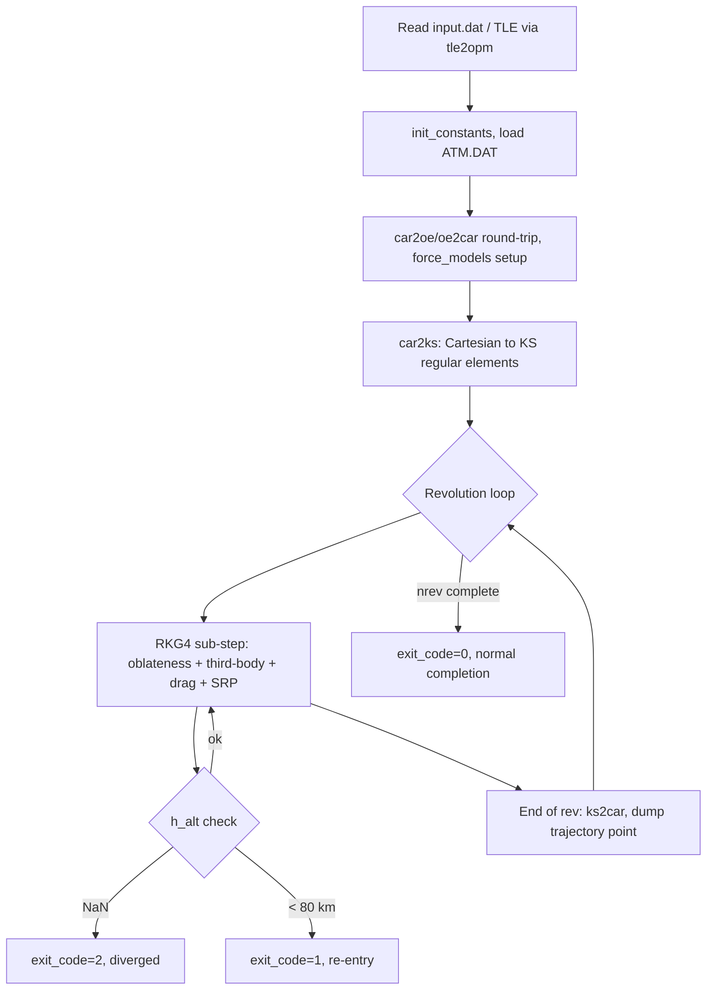

# ALGORITHM.md — KSROP

## 1. Overview
KSROP (KS Regular Orbit Propagator) is a Fortran numerical integrator for
Earth-satellite trajectories, using Kustaanheimo-Stiefel (KS) regularized
elements instead of raw Cartesian state, integrated with a 4th-order
Runge-Kutta-Gill (RKG4) scheme. It is the foundational propagator this
project's other repos build on: `OREM` embeds KSROP's own source files
(`Subrouts.F`, `TLEread.F`, `Legendre.F`, `propagate_ks.F`, which does not
exist as a standalone file in KSROP itself — it was refactored out of
`driver_KS.F` specifically for `OREM`'s callable-subroutine use — see §10)
directly under `OREM\ksrop\`, and `KSRENT-PY` is an independent Python port
of overlapping functionality. KSROP itself is a standalone driver
(`driver_KS.F`) plus a TLE-to-OPM conversion tool (`tle2opm.F`).

## 2. Problem Statement
Numerically integrate a satellite's trajectory forward in time under a
configurable combination of perturbing forces (Earth oblateness, luni-solar
third-body gravity, atmospheric drag, solar radiation pressure), given an
initial Cartesian state and epoch. The KS regularization exists specifically
because raw Cartesian/Keplerian propagation of high-eccentricity orbits
suffers numerical stiffness near perigee (velocity and force gradients spike
as $r\to r_{peri}$); KS elements remove this by transforming the equations of
motion into a 4-dimensional linear-oscillator-like form parameterized by a
fictitious time $s$ (the Sundman transform, $dt = r\,ds$), which stays
numerically well-behaved at any eccentricity without needing an adaptive
step size (KS regularization itself supplies the stability an adaptive
integrator would otherwise be needed for — a fixed-step RKG4 in KS space is
deliberately sufficient, see project memory `feedback_ks_no_adaptive_step`).
"Correct" means: energy and angular momentum conserved to numerical
precision for unperturbed (two-body) cases, orbit closure after one
revolution, and drag-driven decay/re-entry (altitude < 80 km) correctly
detected when drag is enabled on a genuinely decaying orbit.

## 3. Inputs
Read from `input.dat` (via `driver_KS.F`) in this fixed order:
- Initial position `x0(3)` and velocity `xd0(3)`, geocentric inertial frame,
  km / km/s.
- Initial calendar epoch `cal0(6)` = [yr, mo, dy, hr, mn, sc].
- `nrev` (revolutions to propagate), `istep` (RKG4 sub-steps per
  revolution), `tole` (integration tolerance, default `1e-15`).
- Force-model flags `n_force(3)` = [geo, sun, moon] on/off, plus
  `ngeo_deg`/`nsun_deg`/`nmoon_deg` (Legendre expansion degree per force,
  geo configurable up to 2190 via `EGM2008_to2190_TideFree`).
- Drag parameters: `BN` (ballistic number, kg/m², $= m/(C_d A)$), `IDRAG`
  (0/1), `WE_rot` (Earth rotation rate, rad/s), `EPS_f` (oblateness
  flattening), `FR_rot` (atmosphere co-rotation factor).
- SRP parameters: `CR` (reflectivity coefficient), `AM` (area-to-mass,
  m²/kg), `IPSR` (SRP on/off), `ISHAD` (0=none/1=cylindrical/2=conical
  shadow model).
- `ATM.DAT`: tabulated atmospheric density/scale-height vs. altitude
  (60-630 km), read once at startup.
- **Optional** `input/SW-All.csv` (CelesTrak solar/geomagnetic history)
  and `input/ATM2D.DAT` (2-D density/scale-height table over altitude ×
  exospheric temperature, `gen_atm2d_jr71.F`): auto-detected at startup
  (no config flag). When both are present, per-revolution drag uses the
  real historical F10.7/Kp for that epoch instead of the static `ATM.DAT`
  table; absent either file, the legacy static-table path runs unchanged.
  See §9 Known Limitations and `src/swx.F`.
- Alternatively, `tle2opm.F` accepts a real TLE (via `TLEread.F`'s SGP4/SDP4
  implementation) and converts to a CCSDS OPM initial state, so a run can
  start from real catalog data instead of a hand-specified Cartesian state.

## 4. Core Algorithm
1. **Initialization** (`driver_KS.F` / `propagate_ks` entry): read inputs,
   call `init_constants()` to populate the `/xy/` common block (`pi`, `d2r`,
   `r2d`, `amue`, `AU`, `R_Earth`) from `const_new.dat` — the single source
   of truth for physical constants. Load `ATM.DAT` into `ALT_atm`/`DEN_atm`/
   `SCH_atm` arrays.
2. **Coordinate round-trip + force setup**: `car2oe`/`oe2car` round-trip the
   input Cartesian state (self-consistency check), compute the Julian date
   via `cal2jd`, call `force_models` to resolve which perturbations are
   active, and (if `ngeo_deg>1`) precompute zonal-harmonic coefficients via
   `geo_coeff`.
3. **KS transform**: convert the Cartesian state to KS regular elements via
   `car2ks(x, xd, u, us, w)` — a 4-vector position analogue $u$, 4-vector
   "velocity" $u_s$ (derivative w.r.t. fictitious time), and $w$ (related to
   orbital energy). Build the KS time-element $Tow = T + \langle u,
   u_s\rangle / w$ and the initial regular-element state vector
   `y(1..10)` = [time-element, $u_{1..4}$, $2u_{s,1..4}$, $w$].
4. **Per-revolution integration loop** (`do ik = 1, nrev`): for each
   revolution, and at each of `istep` RKG4 sub-steps within it:
   - Recompute Sun/Moon ephemerides (`solarnpv`, `lunarpv`) and third-body
     geometry (`third_body_aux`, for both Sun and Moon independently, each
     with its own configurable Legendre degree).
   - Evaluate the total perturbing-force right-hand-side in KS-element
     space: oblateness (zonal Legendre sum via `aLegP`, up to `ngeo_deg`),
     the (2,2) sectorial **tesseral** term (`tess22_force`, issue #29 —
     auto-detected from a `(2,2)` row in the loaded gravity file, zero
     contribution otherwise; body-fixed longitude alignment via
     `gmst_deg`, refreshed at the same per-stage cadence as the third-body
     ephemerides since GMST is time- not position-dependent), luni-solar
     third-body terms, atmospheric drag (see step 5), and SRP (see step 6)
     — all summed into one force vector consistent with the KS equations
     of motion (the "shape·u + r·Lᵀ∇shape" convention, i.e. the
     $z$-equation of the KS system needs both the harmonic-oscillator shape
     term and the gradient-of-the-perturbing-potential term correctly
     combined — a convention this project got wrong once and fixed, see
     project memory `project_ksrop_gmat_validation`).
   - Advance one RKG4 step in fictitious time $s$ (fixed step $dE_0 =
     2\pi/istep$, scaled by $\Gamma = w/w_{kep}$ to account for the
     perturbed-vs-Keplerian angular rate).
   - Every step: check `h_alt = |r| - R_{Earth}`. If `h_alt` is NaN,
     terminate with `exit_code=2` (divergence). If `h_alt < 80` km, dump the
     re-entry point and terminate with `exit_code=1`.
   - At the end of each completed revolution: convert back to Cartesian
     (`ks2car`) and dump one trajectory point (`traj_jd`, `traj_x`,
     `traj_xd`).
5. **Drag model** (active every sub-step when `IDRAG=1`): an **oblate,
   co-rotating exponential atmosphere referenced to perigee conditions**.
   Each revolution, the current osculating perigee state (via `car2oe`) sets
   a fresh atmospheric co-rotation factor $F_{dg} = (1 -
   R_{PO}\,\omega_E\,F_{rot}\cos\xi / V_{PO})^2$ (recomputed from the
   *current* revolution's perigee, not frozen at the initial epoch — more
   accurate than the literal analytical King-Hele/Sharma theory this model
   descends from). Reference altitude is oblateness-corrected:
   $R_{REQ} = R_{Earth}(1 - \sin^2 i\,\sin^2\omega\,\varepsilon_f)$. Density
   is looked up from `ATM.DAT` (static table) **or, when `input/SW-All.csv`
   and `input/ATM2D.DAT` are both present (auto-detected at startup, see
   §9), from a 2-D table indexed by the real historical exospheric
   temperature at that revolution's own epoch** (`src/swx.F`, ported from
   OREM issue #26) — computed as exponential decay from the perigee
   reference either way: $\rho \propto \exp(-(r-r_0)/H)$. Drag acceleration
   $\propto \rho\,V_{rel}^2/(2\,BN)$, in the co-rotating relative-velocity
   direction. **No diurnal (local-solar-time) density bulge term is
   modeled** — this is a confirmed, documented gap (see project memory
   `reference_orem_reentry_literature`, Sharma 1997a/Swinerd&Boulton 1983
   give the missing term, not yet implemented here).
6. **SRP model**: cannonball (flat, fixed-area-facing-Sun approximation),
   $a_{SRP} = C_R\,(A/m)\,P_{SR}\,(AU/d_{sun})^2$ in the Sun-to-satellite
   direction, gated by a cylindrical or conical Earth-shadow test
   (`ISHAD`).
7. **Termination**: after `nrev` revolutions with no re-entry
   (`exit_code=0`), or early via re-entry (`exit_code=1`) or divergence
   (`exit_code=2`).

## 5. Key Equations / Physics
- **Sundman transform** (fictitious time): $dt = r\,ds$, removing the
  perigee-velocity singularity that afflicts fixed-step Cartesian
  integration of high-eccentricity orbits.
- **KS regular elements**: a bilinear transform mapping 3D position $\vec
  r$ to a 4D "KS space" vector $u$ such that $r = \langle u, u\rangle$ and
  the equations of motion become linear (harmonic-oscillator-like) in $u$
  for the unperturbed two-body problem, with perturbations entering as a
  forcing term.
- **Angular rate scaling**: $w = \sqrt{0.5(\mu/r - V^2/2 - V_{pot})}$,
  $w_{kep} = \sqrt{0.5(\mu/r - V^2/2)}$, $\Gamma = w/w_{kep}$ — the ratio
  between the perturbed and unperturbed angular rates, used to keep the
  fixed fictitious-time step aligned with real orbital phase under
  perturbation.
- **Oblateness potential**: zonal harmonic sum via associated Legendre
  polynomials, $V_{oblate} = \sum_{n\ge2} \mu R_{Earth}^n
  c_n / r^{n+1}\, P_n(\sin\phi)$, configurable up to degree 2190 (EGM2008).
- **General $(n,m)$ tesseral/mascon potential** (issue #30, superseding
  #29's (2,2)-only formula): Cunningham (1970)'s recursive complex solid
  spherical harmonics in body-fixed Cartesian coordinates (no polar/
  equatorial singularity), $V_{n,m} = P_n^m(\sin\phi)\,e^{im\lambda}/
  r^{n+1}$, evaluated for every loaded $0\le m\le n\le n_{max}$
  (`src/Cunningham.F`, `cunningham_Vnm`/`cunningham_dVnm`). Verified
  against the paper's own Table I closed forms to machine precision and,
  at $n=m=2$, to reproduce the original #29 (2,2)-only formula exactly
  (diff ~$10^{-14}$) — the acceptance gate for trusting every other
  $(n,m)$. KS-element force and time-element contributions use the same
  recipe as the zonal terms: $q(j) = V\cdot u(j) + (r/2)\,\partial
  V/\partial u_j$, $\tau = -2rV - (r/2)\sum_j u(j)\,\partial V/\partial
  u_j$, with $\partial V/\partial u_j$ chain-ruled through the closed-form
  KS position Jacobian $\partial x_k/\partial u_j = 2L(u)_{kj}$. Capped at
  `ntess_cap=10` (independent of `ngeo_deg`'s much larger zonal range,
  since Cunningham's recursion is $O(n^2)$ per force evaluation — a real
  per-step cost, not a one-time setup cost like the zonal path). An
  independent second derivation (`src/LegendreTess.F`, classical
  latitude/longitude associated-Legendre expansion rather than Cartesian
  solid harmonics, ported and corrected from an external research
  derivation, 2026-08-09) cross-validates this to machine precision — see
  §8.
- **Drag co-rotation factor**: $F_{dg} = \left(1 - \dfrac{R_{PO}\,\omega_E\,
  F_{rot}\cos\xi}{V_{PO}}\right)^2$, refreshed from the current revolution's
  own perigee state.
- **Re-entry threshold**: fixed at 80 km altitude (not user-configurable in
  the current code).

## 6. Outputs
- CCSDS OEM v2.0 trajectory file (`output/KSROP_<timestamp>.oem`) — full
  time-history of position/velocity.
- KS-elements debug dump (`output/KSROP_<timestamp>_Regular.out`).
- Initial-condition OPM (`output/ksrop.opm`).
- Programmatically (when called as `propagate_ks` from another program, as
  `OREM` does): `traj_jd`/`traj_x`/`traj_xd` arrays (one entry per
  revolution, plus the re-entry point if applicable), `exit_code` (0=normal
  completion, 1=re-entry, 2=divergence).

## 7. Complexity & Performance
Cost scales linearly with `nrev × istep` (one RKG4 evaluation per
sub-step, each evaluation's own cost dominated by the zonal-harmonic sum's
degree — up to 2190 is expensive per step, low-single-digit degrees are
cheap). `benchmark.py` exists in this repo specifically to profile this.
No parallelism is implemented in KSROP itself (a single propagation run is
inherently sequential — each step depends on the previous), so the shared
`GitHub\CLAUDE.md` 4-core cap is not directly exercised here; it becomes
relevant one level up, in `OREM`'s RSM step, which runs 9 independent
`propagate_ks` calls per zone that *could* be parallelized but currently
aren't (run sequentially).

## 8. Validation & Accuracy
611 total checks across 8 Fortran test programs, run via `test_all.sh`
(lint + all suites): `test_subrouts.F` (82, coordinate transforms/utility
subroutines, incl. `gmst_deg`/`geo_coeff_tess22`/`tess22_force`),
`test_tle.F` (147, TLE parsing), `test_tle2sv.F` (156,
SGP4/SDP4 + frame conversions), `test_tle2opm.F` (21, TLE-to-OPM pipeline),
`test_bugs.F` (17, regression tests for specific historical bugs),
`test_sw.F` (17, epoch-resolved space weather — loader/interpolation
correctness including a hand-verified exospheric-temperature value),
`test_cunningham.F` (25, general $(n,m)$ tesseral harmonics, issue #30),
`test_legendre_tess.F` (26, independent classical-Legendre cross-check,
2026-08-09 — see below), plus `test_driver.py` (10) and
`test_initial_conditions.py` (110, multi-orbit sweep) in Python. CI
(`ci.yml`) runs the full suite on every push/PR to `main`/`HS-dev` via
`gfortran` on Ubuntu. Cross-validated against GMAT
(project memory `project_ksrop_gmat_validation`): after fixing 6 real bugs
found during that campaign (including a third-body force that had been
*exactly zero* since an implicit-typing bug, and a wrong KS $z$-equation
convention in an earlier version of this same repo's own history),
Sun-only third-body agreement is ~1.2 m against GMAT reference ephemerides,
full-force (drag+oblateness+third-body) agreement is 1.9 km over 2 GTO
revolutions — with the drag model's own inherent spread (not a KSROP bug)
identified as the dominant remaining source of that residual.

**(2,2) tesseral term (issue #29, 2026-08-08)**: the KS-element force law
itself was verified exactly twice — symbolically against this repo's own
GMAT-validated zonal `q(j)`/`Tau_geo` formula (Phase 4, exact rational
arithmetic), and symbolically against Alvarellos (2009)'s independently
published Mars areopotential (2,2) term, which also reproduced that
paper's own derived $\lambda_{22}$/$J_{22}$ values to stated precision.
A direct GMAT cross-check (Degree=2/Order=2 vs. Order=0, same LEO case)
gave an order-of-magnitude-consistent but phase-differing result —
traced to `gmst_deg` being a mean (IAU 1982) sidereal-time formula versus
GMAT's precise Earth-orientation kernels, not a force-law defect (see §9).
Wiring into the live propagation loop confirmed genuinely active (not a
silent no-op) via a controlled before/after run: ~27–35 m position
divergence over 3 LEO revolutions with real vs. zeroed Earth (2,2)
coefficients.

**General $(n,m)$ tesseral term (issue #30, 2026-08-08)**: 25 checks
(`test_cunningham.F`) — 9 against Cunningham's own Table I closed forms,
3 finite-difference derivative checks, 2 coefficient-loader cross-checks,
and 5 end-to-end checks at $n=m=2$ reproducing the already-validated
(2,2) formula exactly. Rolled out with real data into both KSROP-Lunar
(GRAIL, ~12 m divergence over 10 revs at 100 km) and KSROP-Mars
(Alvarellos/GMM-2B, ~27 km divergence over 20 Mars days at the resonant
areostationary altitude).

**Independent second derivation, `LegendreTess.F` (2026-08-09)**: a
classical spherical-coordinate (latitude/longitude) associated-Legendre
formulation was evaluated as an alternative to Cunningham's Cartesian
solid-harmonic recursion, ported from an external from-scratch KS-
regularized derivation (`EarthGravityPotential_KS (4).wl`). Verification
found and fixed two real bugs in that source derivation before it could
be trusted: (1) the general $(n,m)$ associated Legendre recursion's
$0<m<n$ branch was structurally wrong — confirmed against
`scipy.special.lpmv` ground truth, correct only by coincidence at the
sectorial ($m=n$) and sub-sectorial ($m=n-1$) edges, wrong everywhere
else (error growing from $O(1)$ at $(n,m)=(3,1)$ to $O(10^5)$ by $(8,1)$);
(2) longitude was computed from the wrong coordinate pair ($Y,Z$ instead
of $X,Y$), inconsistent with the same derivation's own latitude
convention ($Z$ as the polar axis, confirmed to match this repo's own
`aLegP(ZbyR)` usage) — confirmed via a pure $(2,2)$ test case that
disagreed with the already-validated Cunningham potential by 50-100+
units (even wrong sign) using the source formula, matching to $10^{-14}$
once corrected. With both fixed, `tess_legendre_force` reproduces
`tess_general_force` to machine precision (worst case $5.6\times10^{-15}$)
across $n_{max}=2..6$, random full-triangle $C_{nm}/S_{nm}$, random $u$
(`test_legendre_tess.F`, 26/26 pass on both `ifx` and `gfortran`).

**Wired into the live propagation loop as a selectable alternative**
(2026-08-09, same day): `driver_KS.F` reads an optional 6th `input.dat`
line, `ITESS_METHOD` (0=Cunningham, default — every pre-existing
`input.dat` without this line keeps running unchanged; 1=LegendreTess),
and branches the general-$(n,m)$ force call between
`tess_general_force`/`tess_legendre_force` accordingly — both already
share the identical `q(j)`/`tau` interface, so no other code changed.
Verified genuinely active and correct via a real before/after
propagation (real EGM2008 data, `ngeo_deg=50` → `ntess_use=10`, 3601
steps): the two methods' OEM output is identical to the file's own
printed precision (mm-level position, µm/s-level velocity) and the
higher-precision KS-element debug dump (`10f20.9` format) is byte-for-
byte identical — the two independently-derived force paths agree at
this propagation's own printed precision, not just at the isolated
force-vector level.

## 9. Known Limitations
- **Tesseral gravity degree is capped at `ntess_cap=10`** (general $(n,m)$
  support itself is not limited to (2,2) — see §5/§8, issue #30). The cap
  exists because Cunningham's recursion is $O(n^2)$ *per force evaluation*
  (every RKG4 sub-step), unlike the zonal path's one-time-per-file-load
  cost — a real, literal degree-2190 EGM2008 field is computationally
  infeasible as a per-step force model regardless of which general-$(n,m)$
  method is used (classical latitude/longitude Legendre expansion is the
  same $O(n^2)$ complexity class, confirmed via the independent
  `LegendreTess.F` derivation, §8). Raising the cap for a specific higher-
  precision use case is a config-constant change, not a new derivation.
- **`gmst_deg` is a mean (IAU 1982 polynomial) sidereal-time formula**, not
  a true-rotation-angle model (no UT1-UTC, nutation, or polar-motion
  correction). Confirmed via a GMAT cross-check (§8) to be precise enough
  for the ~130-day timescales the (2,2) term's real motivating use case
  (Mars areostationary libration, see KSROP-Mars) operates on, but not for
  sub-day tesseral-phase accuracy — a future fix if that precision is ever
  needed, not currently planned.
- **No diurnal atmospheric density bulge** (day/night density variation) —
  confirmed absent from the drag model; a specified, literature-validated
  fix exists (Sharma 1997a's Santora-1975-based term) but is not
  implemented. See project memory `reference_orem_reentry_literature`.
- **Density model form is exponential/scale-height referenced to perigee**
  (King-Hele/Sharma lineage), not a full empirical atmosphere model like
  MSIS2000 or Jacchia-Bowman. Per a direct comparison against the ISO/CD
  27852 orbit-lifetime draft standard's own model tiering (2026-07-25,
  `OREM`'s Phase 5 investigation), this places KSROP in that standard's
  acceptable-but-not-best-fidelity tier ("not ideal, [but] can work well"
  — the standard's own words for the Jacchia-1971-class lineage this model
  descends from), not its explicitly-named "avoid" category. A real
  accuracy ceiling, but a much larger undertaking than the diurnal-bulge
  gap above (a new atmosphere model, not a missing term).
- ~~Epoch-resolved space weather~~ — **fixed 2026-07-25**: `driver_KS.F`
  now auto-detects `input/SW-All.csv`/`input/ATM2D.DAT` and uses real
  historical F10.7/Kp per revolution when present (ported from OREM issue
  #26; see §10 Dependencies and the README Revision History). The
  generator (`gen_atm2d_jr71.F`) had existed here since before the port,
  but nothing consumed its output at runtime until now.
- Re-entry altitude threshold (80 km) is hardcoded, not configurable.
- No adaptive step size — deliberate (KS regularization itself provides the
  numerical stability an adaptive scheme would otherwise be needed for),
  but this means step count must be chosen up front per problem, not
  auto-tuned.
- `gfortran` portability required several fixes documented in project
  memory (`project_ksrop_production_packaging`) — `cn0`/`aLegP` array-rank
  issues, TLE mean-motion parsing, an `iE` implicit-typing trap; these are
  fixed, but are a reminder that this codebase's Fortran dialect
  compatibility isn't automatic across compilers.

## 10. Dependencies
- **Standalone** — KSROP has no dependency on any other repo under
  `GitHub\`.
- **Depended on by `OREM`**: `OREM\ksrop\` embeds direct copies of
  `Subrouts.F`, `TLEread.F`, `Legendre.F`, and a refactored
  callable-subroutine version of the propagation loop
  (`propagate_ks.F`, factored out of this repo's `driver_KS.F` — same
  physics, restructured as a subroutine rather than a standalone program
  with file I/O, specifically so `OREM` could call it many times per zone
  without shelling out to a separate executable).
- **Related to `KSRENT-PY`**: an independent Python port covering
  overlapping functionality (KS transforms, TLE reading) — not a shared
  source, a separate reimplementation (see `KSRENT-PY\ALGORITHM.md`).
- **External data**: EGM2008 geopotential coefficients (`EGM2008_to2190_
  TideFree`, ~231 MB, not committed in full — sourced separately; its
  `(2,2)` row also feeds `geo_coeff_tess22`, auto-detected — see §9),
  `ATM.DAT` atmosphere table.
